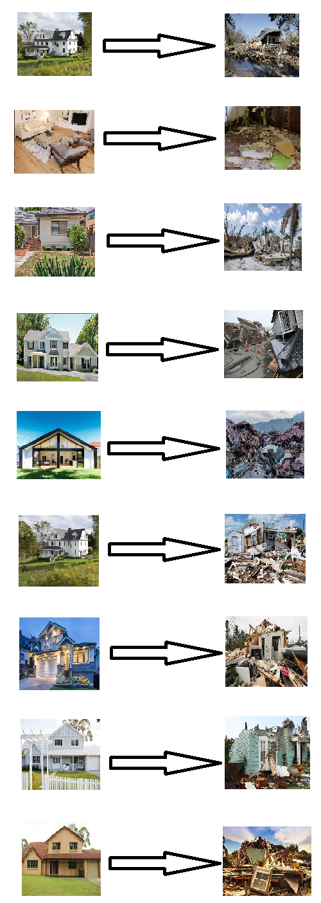

# Generating-disaster-image-from-input-image-using-DiscoGAN
----------------
Using DiscoGAN to generate image of how houses and landscapes would look like after a natural disaster make people realize the personal cost they might have to pay due to climate change

----------------

## Prerequisites
-------------
   - Python 3.7.10
   - PyTorch
   - Numpy/Scipy/Pandas
   - Progressbar
   - OpenCV
----------------

## Loading dataset
----------------
Run the following code snippet in the notebook

		import os
		!mkdir './dataset/houses'
		!mkdir './dataset/disasters'

Download, unzip and store the data as follows:

		https://www.kaggle.com/amir22010/house-price

in "houses" directory 

		https://www.kaggle.com/mikolajbabula/disaster-images-dataset-cnn-model

*Only the earthquake images* in "disasters" directory

----------------
 
## Training DiscoGAN
----------------

Run the cells in the notebook (./discogan/model notebook) in order.

----------------

## Results
----------------

The training data is described above and we used random images of houses from Google for testing. Some of the generated images are shown above.

----------------

## Purpose

----------------

Climate change will eventually affect all 7 billion of us on Earth. Yet, only a few people realize the urgency to act. This project is intended to help people visualize how the places they love might look if climate change continues. It is said, "a picture is worth a thousand words", so, these generated pictures might be able to work the magic on some minds that a world wide web full of statistics could not. :)
